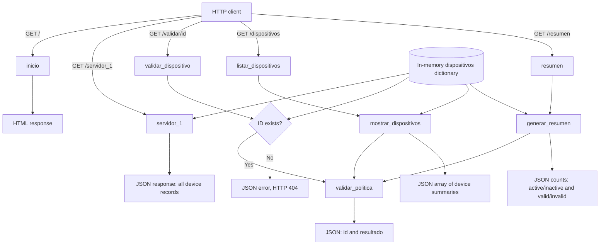

# `app.py` Overview

## Purpose and Architecture

`app.py` implements a small Flask application for displaying and validating a fixed set of network devices. Device records live in the module-level `dispositivos` dictionary in memory; there is no database, external API client, request-body parser, or authentication layer in this file.

The architecture has three simple parts:

1. **Data**: `dispositivos` holds device IDs and their IP, name, policy, and status.
2. **Business logic**: `validar_politica`, `mostrar_dispositivos`, and `generar_resumen` validate records, produce a detailed list, and count status/validation results.
3. **HTTP layer**: Flask routes call that logic and return HTML or JSON responses.

All routes use Flask's default `GET` method. The application has no route that accepts a JSON request body or query parameters.

## Routes

| Route | Input | Output |
| --- | --- | --- |
| `GET /` | No parameters or body. | An HTML string containing the heading `Hola mundo` and a link to `https://127.0.0.1:5000/api/saludo`. The link target is not implemented in this file. |
| `GET /servidor_1` | No parameters or body. | JSON serialization of the complete `dispositivos` dictionary, keyed by device ID. |
| `GET /validar/<dispositivo_id>` | One URL path parameter, `dispositivo_id`. No body. | For a known ID, JSON with `id` and `resultado`. For an unknown ID, JSON `{"error":"Dispositivo no encontrado"}` and HTTP status `404`. |
| `GET /dispositivos` | No parameters or body. | A JSON array containing each device's ID, name, IP, policy, status, and policy-validation result. |
| `GET /resumen` | No parameters or body. | JSON with counts for `activos`, `inactivos`, `validos`, and `invalidos`. |

### Response details

- `/` returns a Python string, which Flask serves as an HTML response.
- The other routes use `jsonify`, so successful and not-found responses are JSON.
- `/servidor_1` returns the stored fields as written. In particular, the device-name key in the source data is spelled `divice` (not `device`).
- `/dispositivos` maps that source key to the output field `Nombre`; its output keys are `ID`, `Nombre`, `IP`, `Política`, `Estado`, and `Resultado`.
- `/resumen` counts a device as active only when `Status` is `True`; any other value is counted as inactive. A policy result exactly equal to `Configuración válida` increments `validos`; all other results increment `invalidos`.

## Functions

| Function | Inputs | Return value / output |
| --- | --- | --- |
| `inicio()` | None. Called by `GET /`. | HTML string with a greeting and a link. Flask sends it as the route response. |
| `servidor_1()` | None. Called by `GET /servidor_1`. | Flask JSON response containing all of `dispositivos`. |
| `validar_politica(dispositivo)` | A dictionary for one device. It reads `ip` (default `""`) and `policy` (default `[""]`). | One of these strings: `Configuración válida`; `Configuración inválida (IP bloqueada)`; `Configuración inválida (IP incorrecta)`; or `Configuración inválida`. `ALLOW_ALL` is accepted, `BLOCK_IP` is rejected, and `REQUIRED_IP` is accepted only if the device IP is in the hard-coded allowlist. |
| `validar_dispositivo(dispositivo_id)` | `dispositivo_id`, taken from the URL path in `GET /validar/<dispositivo_id>`. | For a known ID, a Flask JSON response with `{ "id": ..., "resultado": ... }`. For an unknown ID, a Flask JSON response with an `error` field and status `404`. |
| `mostrar_dispositivos(dicc_dispositivos)` | A dictionary of device IDs to device dictionaries; the route passes the module-level `dispositivos`. | A Python list of device-summary dictionaries. Each entry contains `ID`, `Nombre`, `IP`, `Política`, `Estado`, and `Resultado`; `Resultado` comes from `validar_politica`. |
| `listar_dispositivos()` | None. Called by `GET /dispositivos`. | Flask JSON response containing the list returned by `mostrar_dispositivos(dispositivos)`. |
| `generar_resumen(dicc_dispositivos)` | A dictionary of device IDs to device dictionaries; the route passes `dispositivos`. | A Python dictionary of integer counts: `{ "activos": ..., "inactivos": ..., "validos": ..., "invalidos": ... }`. |
| `resumen()` | None. Called by `GET /resumen`. | Flask JSON response containing the dictionary returned by `generar_resumen(dispositivos)`. |

### Application entry point

When `app.py` is run directly, the `if __name__ == '__main__'` block calls `app.run(debug=True)` to start Flask's development server with debug mode enabled. It does not run when this module is imported by another module or a WSGI server.

## Data Flow

## Notes

- The `/` page links to `/api/saludo`, but no `/api/saludo` route is defined in `app.py`; following that link will not be handled by this application unless another component supplies it.
- `dispositivos` is hard-coded and in-memory. Changes are not persisted and will be reset when the process restarts.
- Debug mode is suitable for local development, not production deployment.